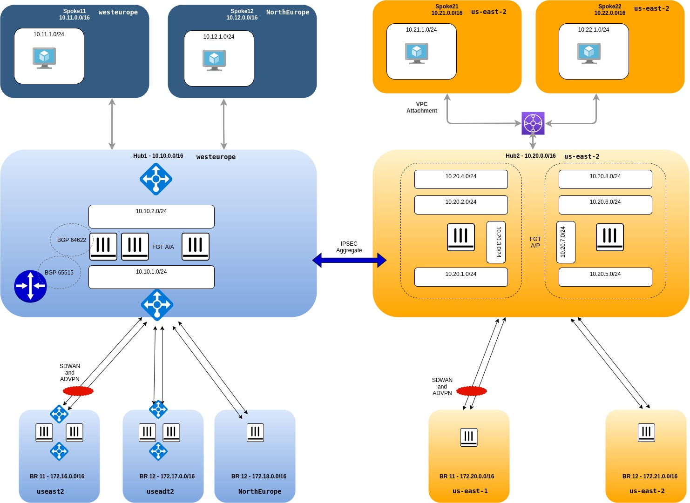

# Azure K8S Micro Segmentation Workshop

## Workshop main objectives

* Explore FortiGate Active-Active Integration with Azure Route Server
* Explore SDWAN and ADVPN Shortcut establishement in Azure (both behind LB and without LB)
* Explore overlay creation in an automated fasion between FGT in multiple clouds. This will leverage FOS Terraform provider and FOS IPSEC Aggregate feature.

